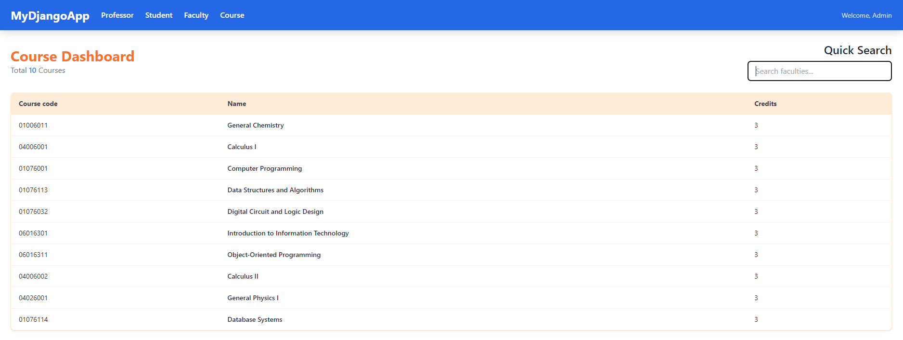

# WEEK 7 EXCERCISE


1. สร้าง project ชื่อ `kmitl`

2. สร้าง database ใหม่ชื่อ `kmitl`

3. ให้ทำการ startapp ชื่อ `registration`

4. ให้ copy code ข้างล่างไปใส่ที่ไฟล์ `registration/models.py`

```PYTHON
from django.db import models


class Faculty(models.Model):
    name = models.CharField(max_length=100, unique=True)
    code = models.CharField(max_length=10, unique=True)

    def __str__(self):
        return self.name


class Professor(models.Model):
    first_name = models.CharField(max_length=100)
    last_name = models.CharField(max_length=100)
    faculty = models.ForeignKey(Faculty, on_delete=models.SET_NULL, null=True)

    def __str__(self):
        return f"{self.first_name} {self.last_name}"


class Course(models.Model):
    course_code = models.CharField(max_length=20, unique=True)
    course_name = models.CharField(max_length=200)
    credits = models.PositiveSmallIntegerField()

    def __str__(self):
        return f"{self.course_code} {self.course_name}"


class Section(models.Model):
    class DayOfWeek(models.TextChoices):
        MONDAY = "MON", "จันทร์"
        TUESDAY = "TUE", "อังคาร"
        WEDNESDAY = "WED", "พุธ"
        THURSDAY = "THU", "พฤหัสบดี"
        FRIDAY = "FRI", "ศุกร์"

    course = models.ForeignKey(Course, on_delete=models.CASCADE)
    section_number = models.CharField(max_length=3)
    semester = models.CharField(max_length=10)
    professor = models.ForeignKey(
        Professor, on_delete=models.SET_NULL, null=True, blank=True
    )
    day_of_week = models.CharField(max_length=3, choices=DayOfWeek.choices)
    start_time = models.TimeField()
    end_time = models.TimeField()
    capacity = models.PositiveSmallIntegerField(default=60)

    def __str__(self):
        return f"{self.course.course_code} ({self.section_number}) - {self.semester})"


class Student(models.Model):
    student_id = models.CharField(max_length=10, unique=True)
    first_name = models.CharField(max_length=100)
    last_name = models.CharField(max_length=100)
    faculty = models.ForeignKey(Faculty, on_delete=models.PROTECT)
    # ความสัมพันธ์จะถูกย้ายมาอยู่ที่นี่
    enrolled_sections = models.ManyToManyField(Section, blank=True)

    def __str__(self):
        return f"{self.student_id} - {self.first_name}"


class StudentProfile(models.Model):
    student = models.OneToOneField(Student, on_delete=models.CASCADE, primary_key=True)
    email = models.EmailField(unique=True)
    phone_number = models.CharField(max_length=15, blank=True, null=True)
    address = models.TextField(blank=True, null=True)

    def __str__(self):
        return f"Profile of {self.student.first_name}"

```

5. ให้ทำการ makemigrations และ migrate

6. ให้นักศึกษา run ไฟล์ kmitl_db.sql เพื่อ Insert ข้อมูลลง database

7. ให้นักศึกษาลากโฟลเดอร์ `templates` และ `templatetags` ใน excercise ไปไว้ที่โฟลเดอร์ `registration` ขอโปรเจคนักศึกษา

```sh
templates/
    - index.hmtl
    - nav.html
    - professor.html
    - course.html
    - faculty.html
```

## 1. แสดงผลข้อมูลใน Template

> สำหรับแบบฝึกหัดนี้ให้สร้าง View แบบ "class-based view"

1.1 ให้นักศึกษาสร้าง View และกำหนด URL ให้แสดงข้อมูลของพนักงานทั้งหมดในฐานข้อมูลในไฟล์ index.html ตามภาพ (0.25 คะแนน)


1.2 ให้นักศึกษาสร้าง View และกำหนด URL ให้แสดงข้อมูลของตำแหน่งงาน และแสดงจำนวนของพนักงานในไฟล์ professor.html ตามภาพ (0.25 คะแนน)


1.3 ให้นักศึกษาสร้าง View และกำหนด URL ให้แสดงข้อมูลโปรเจคทั้งหมดในไฟล์ course.html ตามภาพ (0.25 คะแนน)



1.4 ให้นักศึกษาสร้าง View และกำหนด URL ให้แสดงข้อมูลโปรเจคทั้งหมดในไฟล์ faculty.html ตามภาพ (0.25 คะแนน)


1.5 กำหนด PATH สำหรับ Navbar ของเว็บไซต์ในไฟล์ nav.html (0.25 คะแนน)

**Hint:** ใช้ template tag "url" [Ref](https://docs.djangoproject.com/en/5.0/ref/templates/builtins/#url)

```HTML
    <header>
        <nav>
            <!-- กำหนด path  -->
            <a href="/">Professor</a>
            <a href="/">Student</a>
            <a href="/">Faculty</a>
            <a href="/">Course</a>
        </nav>
    </header>
```

1.5 ให้นักศึกษาเขียนให้ Quick Search ในทุก ๆ หน้า

**Hint:** ใช้ request.GET.get("key_param") เพื่อให้สามารถดึงข้อมูล Param จาก URLs ได้

- หน้า Student: สามารถเลือก `Field` ที่จะ `Filter` ได้ โดยเมื่อ Input แล้วนำข้อมูลที่กรอกไปใช้ โดยขอแค่อยู่ภายใน `Field` ที่เลือก และไม่สนตัวเล็กและตัวใหญ่

  - Full Name (Default)

    

  - Email

    

  - Faculty

    

- หน้า Professor: สามารถเลือก `Field` ที่จะ `Filter` ได้ โดยเมื่อ Input แล้วนำข้อมูลที่กรอกไปใช้ โดยขอแค่อยู่ภายใน `Field` ที่เลือก และไม่สนตัวเล็กและตัวใหญ่

  - Full Name (Default)

    

  - Faculty

    

- หน้า Faculty: เมื่อ Input แล้วนำข้อมูลที่กรอกไปใช้ `Filter` ชื่อ ขอแค่ข้อมูลอยู่ภายใน และไม่สนตัวเล็กตัวใหญ่

    

- หน้า Course: เมื่อ Input แล้วนำข้อมูลที่กรอกไปใช้ `Filter` ชื่อ ขอแค่ข้อมูลอยู่ภายใน และไม่สนตัวเล็กตัวใหญ่

    

## 2. ลบ-แก้ไข ข้อมูล

2.1. จากข้อที่ 1.3 เมื่อกดที่ปุ่ม แก้ไข จะไปหน้าเว็บที่แสดงรายละเอียดของโปคเจคในไฟล์ project_detail.html และให้แสดงข้อมูลของโปรเจคที่ต้องการแก่้ไขตามภาพ (0.25 คะแนน)


2.2 จากข้อที่ 1.3 ให้นักศึกษาเพิ่ม View สำหรับ ลบโปรเจค และไปแก้ไข url ใน function deleteProject(pro_id) ในไฟล์ project.html (0.25 คะแนน)

2.3 ต่อข้อ 2.1 ให้นักศึกษาเพิ่ม View สำหรับเพิ่มพนักงานเข้าไปใน project ด้วยการกรอก ID โดยกำหนดให้ใช้ Method `PUT` และไปแก้ไข function addStaff() ในไฟล์ project_detail.html (0.5 คะแนน)

2.4. ต่อข้อ 2.1 ให้นักศึกษาสร้าง path สำหรับเพิ่มลบพนักงานออกจากโปรเจคหลังจากกดปุ่ม Kick this Staff โดยกำหนดให้ใช้ Method `DELETE` และไปแก้ไข function removeStaff(emp_Id) ในไฟล์ project_detail.html (0.5 คะแนน)

**Hint:** สำหรับข้อ 2.2 - 2.4 เราสามารถส่ง response เป็น json ได้โดยใช้ JsonResponse

```python
from django.views import View
from django.http import JsonResponse

class MyView(View):

    def get(self, request):
        # Do what you view needs to do
        return JsonResponse({'foo':'bar'}, status=200)
```

## Demo

https://youtu.be/xIr_FoIuOks
