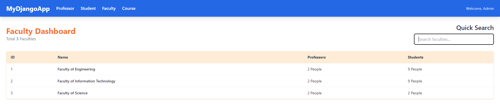

# WEEK 7 EXCERCISE


1. สร้าง project ชื่อ `kmitl`

2. สร้าง database ใหม่ชื่อ `kmitl`

3. ให้ทำการ startapp ชื่อ `registration`

4. ให้ copy code ข้างล่างไปใส่ที่ไฟล์ `registration/models.py`

```PYTHON
from django.db import models


class Faculty(models.Model):
    name = models.CharField(max_length=100, unique=True)
    code = models.CharField(max_length=10, unique=True)

    def __str__(self):
        return self.name


class Professor(models.Model):
    first_name = models.CharField(max_length=100)
    last_name = models.CharField(max_length=100)
    faculty = models.ForeignKey(Faculty, on_delete=models.SET_NULL, null=True)

    def __str__(self):
        return f"{self.first_name} {self.last_name}"


class Course(models.Model):
    course_code = models.CharField(max_length=20, unique=True)
    course_name = models.CharField(max_length=200)
    credits = models.PositiveSmallIntegerField()

    def __str__(self):
        return f"{self.course_code} {self.course_name}"


class Section(models.Model):
    class DayOfWeek(models.TextChoices):
        MONDAY = "MON", "จันทร์"
        TUESDAY = "TUE", "อังคาร"
        WEDNESDAY = "WED", "พุธ"
        THURSDAY = "THU", "พฤหัสบดี"
        FRIDAY = "FRI", "ศุกร์"

    course = models.ForeignKey(Course, on_delete=models.CASCADE)
    section_number = models.CharField(max_length=3)
    semester = models.CharField(max_length=10)
    professor = models.ForeignKey(
        Professor, on_delete=models.SET_NULL, null=True, blank=True
    )
    day_of_week = models.CharField(max_length=3, choices=DayOfWeek.choices)
    start_time = models.TimeField()
    end_time = models.TimeField()
    capacity = models.PositiveSmallIntegerField(default=60)

    def __str__(self):
        return f"{self.course.course_code} ({self.section_number}) - {self.semester})"
        
    def dayOfWeek(self):
        weekday = {"MON": 0, "TUE": 1, "WED": 2, "THU": 3, "FRI": 4}
        return weekday[self.day_of_week]


class Student(models.Model):
    student_id = models.CharField(max_length=10, unique=True)
    first_name = models.CharField(max_length=100)
    last_name = models.CharField(max_length=100)
    faculty = models.ForeignKey(Faculty, on_delete=models.PROTECT)
    # ความสัมพันธ์จะถูกย้ายมาอยู่ที่นี่
    enrolled_sections = models.ManyToManyField(Section, blank=True)

    def __str__(self):
        return f"{self.student_id} - {self.first_name}"


class StudentProfile(models.Model):
    student = models.OneToOneField(Student, on_delete=models.CASCADE, primary_key=True)
    email = models.EmailField(unique=True)
    phone_number = models.CharField(max_length=15, blank=True, null=True)
    address = models.TextField(blank=True, null=True)

    def __str__(self):
        return f"Profile of {self.student.first_name}"

```

5. ให้ทำการ makemigrations และ migrate

6. ให้นักศึกษา run ไฟล์ kmitl_db.sql เพื่อ Insert ข้อมูลลง database

7. ให้นักศึกษาลากโฟลเดอร์ `templates` และ `templatetags` ใน excercise ไปไว้ที่โฟลเดอร์ `registration` ขอโปรเจคนักศึกษา

```sh
registration/
    - templates/
        - index.hmtl
        - nav.html
        - professor.html
        - course.html
        - faculty.html
    - templatetags/
        - custom_filter.py
```

## 1. แสดงผลข้อมูลใน Template

> สำหรับแบบฝึกหัดนี้ให้สร้าง View แบบ "class-based view"

1.1 ให้นักศึกษาสร้าง View และกำหนด URL ให้แสดงข้อมูลของนักเรียนทั้งหมดในไฟล์ index.html ตามภาพ (0.2 คะแนน)


1.2 ให้นักศึกษาสร้าง View และกำหนด URL ให้แสดงข้อมูลของอาจารย์ทั้งหมดในไฟล์ professor.html ตามภาพ (0.2 คะแนน)


1.3 ให้นักศึกษาสร้าง View และกำหนด URL ให้แสดงข้อมูลคอร์สทั้งหมดในไฟล์ course.html ตามภาพ (0.2 คะแนน)


1.4 ให้นักศึกษาสร้าง View และกำหนด URL ให้แสดงข้อมูลคณะทั้งหมดในไฟล์ faculty.html ตามภาพ (0.2 คะแนน)



1.5 กำหนด PATH สำหรับ Navbar ของเว็บไซต์ในไฟล์ nav.html (0.2 คะแนน)

**Hint:** ใช้ template tag `url` - [DOC](https://docs.djangoproject.com/en/5.2/ref/templates/builtins/#url)

```HTML
    <header>
        <nav>
            <!-- กำหนด path  -->
            <a href="/">Professor</a>
            <a href="/">Student</a>
            <a href="/">Faculty</a>
            <a href="/">Course</a>
        </nav>
    </header>
```

1.6 ให้นักศึกษาเขียนให้ Quick Search ในทุก ๆ หน้า

**Hint:** ใช้ request.GET.get("key_param") เพื่อให้สามารถดึงข้อมูล Param จาก URLs ได้

- หน้า Student: สามารถเลือก `Field` ที่จะ `Filter` ได้ โดยเมื่อ Input แล้วนำข้อมูลที่กรอกไปใช้ โดยขอแค่อยู่ภายใน `Field` ที่เลือก และไม่สนตัวเล็กและตัวใหญ่ (0.5 คะแนน)

  - Full Name (Default)

    

  - Email

    

  - Faculty

    

- หน้า Professor: สามารถเลือก `Field` ที่จะ `Filter` ได้ โดยเมื่อ Input แล้วนำข้อมูลที่กรอกไปใช้ โดยขอแค่อยู่ภายใน `Field` ที่เลือก และไม่สนตัวเล็กและตัวใหญ่ (0.3 คะแนน)

  - Full Name (Default)

    

  - Faculty

    

- หน้า Faculty: เมื่อ Input แล้วนำข้อมูลที่กรอกไปใช้ `Filter` ชื่อ ขอแค่ข้อมูลอยู่ภายใน และไม่สนตัวเล็กตัวใหญ่ (0.1 คะแนน)

    

- หน้า Course: เมื่อ Input แล้วนำข้อมูลที่กรอกไปใช้ `Filter` ชื่อ ขอแค่ข้อมูลอยู่ภายใน และไม่สนตัวเล็กตัวใหญ่ (0.1 คะแนน)

    

## 2. เพิ่มข้อมูลนักเรียน

2.1. จากหน้า Student ให้นักศึกษาเพิ่มปุ่มสำหรับเพิ่มข้อมูลนักศึกษาดังรูปโดยมันจะต้องกดแล้วไปที่ url สำหรับสร้างข้อมูล จากนั้นทำการเพิ่ม View โดยกำหนดให้ใช้ Method `POST` และใช้ไฟล์ create_student.html (แก้ไข url ในไฟล์ให้ถูกต้อง) (0.5 คะแนน)
- ปุ่ม create student

- หน้าสร้างข้อมูลนักศึกษา


**ใน View ที่สร้างนักเรียนเมื่อ create Student สำเร็จให้ทำการ `redirect` ไปที่หน้า รายชื่อนักเรียน (index.html)**
